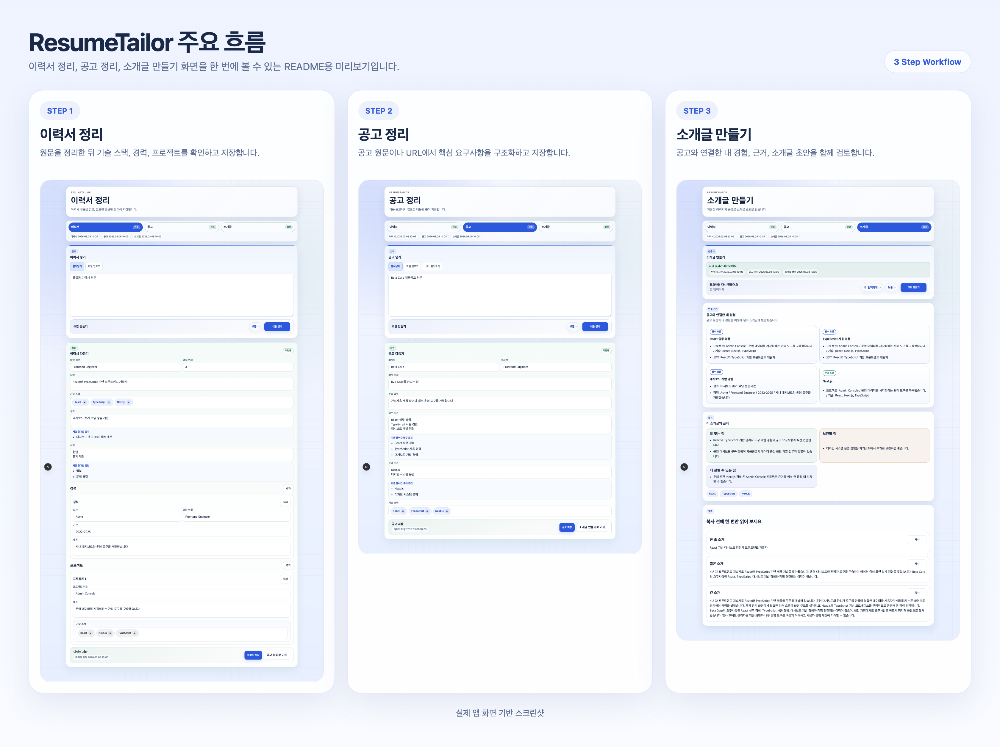

# ResumeTailor (Local MVP)

로컬에서 이력서와 채용공고 텍스트를 입력하면 `@openai/codex-sdk`와 `SKILL.md` 파이프라인으로 구조화 JSON을 만들고, 회사 맞춤 자기소개를 생성하는 Next.js 앱입니다.

## 화면 미리보기



이력서 정리, 공고 정리, 소개글 생성 흐름을 보여주는 실제 앱 화면 예시입니다.

## 1. 빠른 시작

이 프로젝트는 세 가지 방식으로 실행할 수 있습니다.

- Docker Hub 이미지로 실행
- 저장소를 clone해서 `docker compose`로 실행
- 로컬 개발 실행: 개발자가 Node.js와 Codex CLI를 직접 설치해서 실행

### 1.1 Docker Hub 이미지로 바로 실행

기본 이미지는 `qrqr/resume-tailor:latest`입니다.

중요:

- Docker Desktop 또는 Docker Engine
- Codex 로그인 가능한 계정
- ChatGPT 설정 `보안`에서 `Codex용 장치 코드 인증 활성화`
- Docker에서는 브라우저 리다이렉트보다 `--device-auth` 사용 권장
- `/resume`과 `/company`의 `URL 불러오기`를 사용할 수 있습니다.
- 이미지 기반 상세 공고는 macOS에서는 Vision OCR, Docker/Linux에서는 Tesseract OCR로 보강을 시도합니다. 다만 Docker/Linux 결과는 macOS보다 품질 차이가 있을 수 있습니다.

실행 명령:

```bash
docker pull qrqr/resume-tailor:latest
docker volume create resume-tailor-codex

docker run --rm -it \
  -v resume-tailor-codex:/root/.codex \
  qrqr/resume-tailor:latest \
  codex login --device-auth

docker run -d \
  --name resume-tailor-app \
  -p 3000:3000 \
  -v resume-tailor-codex:/root/.codex \
  qrqr/resume-tailor:latest
```

- 접속 주소: [http://localhost:3000](http://localhost:3000)
- 로그인 정보는 `resume-tailor-codex` Docker volume에 저장됩니다.

종료할 때:

```bash
docker stop resume-tailor-app
```

다시 시작할 때:

```bash
docker start resume-tailor-app
```

컨테이너를 삭제하고 새로 만들 때:

```bash
docker rm -f resume-tailor-app
```

컨테이너와 로그인 정보까지 완전히 정리할 때:

```bash
docker rm -f resume-tailor-app
docker volume rm resume-tailor-codex
```

- `resume-tailor-codex` volume을 지우면 Codex 로그인 정보도 함께 삭제됩니다.

<details>
<summary>선택 사항: 이미지 갱신, 포트 변경, 로그 확인</summary>

이미지를 갱신할 때:

```bash
docker pull qrqr/resume-tailor:latest
docker rm -f resume-tailor-app

docker run -d \
  --name resume-tailor-app \
  -p 3000:3000 \
  -v resume-tailor-codex:/root/.codex \
  qrqr/resume-tailor:latest
```

포트 변경:

```bash
docker rm -f resume-tailor-app

docker run -d \
  --name resume-tailor-app \
  -p 3100:3000 \
  -v resume-tailor-codex:/root/.codex \
  qrqr/resume-tailor:latest
```

로그 확인과 컨테이너 삭제:

```bash
docker logs -f resume-tailor-app
docker rm -f resume-tailor-app
```

</details>

### 1.2 저장소를 clone해서 `docker compose`로 실행

반복 실행, 포트/볼륨 관리, 커스텀 이미지 override가 필요하면 저장소를 clone한 뒤 `docker compose`로 실행합니다.

```bash
git clone https://github.com/aqwsde321/resume-tailor.git
cd resume-tailor
docker compose pull
docker compose run --rm app codex login --device-auth
docker compose up -d
```

- 접속 주소: [http://localhost:3000](http://localhost:3000)
- 일반 사용자는 `docker compose build`가 필요 없습니다.
- Compose 방식에서는 로그인 정보가 `codex-home` Docker volume에 저장됩니다.

종료할 때:

```bash
docker compose stop
```

컨테이너와 네트워크까지 정리할 때:

```bash
docker compose down
```

로그인 정보 volume까지 완전히 정리할 때:

```bash
docker compose down -v
```

- `docker compose down -v`를 실행하면 `codex-home` volume도 삭제되어 다시 로그인해야 합니다.

<details>
<summary>선택 사항: 이미지 갱신, 포트 변경, 이미지 override</summary>

이미지를 갱신할 때:

```bash
docker compose pull
docker compose up -d
```

포트를 바꾸고 싶을 때:

```bash
APP_PORT=3100 docker compose up -d
```

다른 이미지를 쓰고 싶을 때:

```bash
export RESUME_TAILOR_IMAGE=my-dockerhub-id/resume-tailor:latest
docker compose pull
docker compose up -d
```

</details>

<details>
<summary>개발자용: 로컬 이미지 빌드</summary>

```bash
docker build -t resume-tailor:local .
RESUME_TAILOR_IMAGE=resume-tailor:local docker compose up -d
```

</details>

추가 운영 명령과 장애 대응 절차는 [운영 런북](./docs/OPS_RUNBOOK.md)을 참고하세요.

### 1.3 로컬 개발 실행

Docker를 쓰지 않고 직접 실행하려면 아래가 필요합니다.

- Node.js 20 이상
- npm
- Codex 앱 또는 Codex CLI
- Codex 로그인 가능한 계정
- `typst` CLI: `/result`의 PDF 내보내기를 로컬에서 쓰려면 PATH에 있어야 합니다.

Node.js는 LTS 설치를 권장합니다.

- 공식 다운로드: [https://nodejs.org/en/download](https://nodejs.org/en/download)
- Codex CLI 문서: [https://developers.openai.com/codex/cli](https://developers.openai.com/codex/cli)

기본 실행 순서:

```bash
npm i -g @openai/codex
codex login
npm install
npm run dev
```

브라우저에서 [http://localhost:3000](http://localhost:3000)으로 접속하면 루트 경로가 `/resume`으로 이동합니다.

<details>
<summary>macOS에서 Codex 앱 번들을 직접 쓰는 경우</summary>

macOS에서 Codex 앱 번들을 직접 쓸 때는 같은 터미널 세션에서 아래처럼 지정할 수 있습니다.

```bash
export CODEX_CLI_PATH=/Applications/Codex.app/Contents/Resources/codex
$CODEX_CLI_PATH login
npm run dev
```

</details>

## 2. 첫 사용 흐름

1. `/resume`에서 이력서 텍스트를 붙여넣거나 `txt`, URL로 불러온 뒤 분석하고, 폼을 수정해 확정합니다.
2. `/company`에서 채용공고 텍스트를 붙여넣거나 `txt`, URL로 불러온 뒤 분석하고, 폼을 수정해 확정합니다.
3. `/result`에서 자기소개를 생성하거나 다시 생성합니다.
4. 최신 소개글이 준비되면 `/pdf` step 4로 이동해 소개글과 PDF용 필드를 마지막으로 수정하고 PDF를 내려받습니다.

참고:

- 각 단계 입력 카드에서 `생각 깊이`를 선택할 수 있고, 높을수록 결과 생성 시간이 늘어날 수 있습니다.
- 화면에는 현재 단계, 작업 중 상태, AI 분석 로그, 이전 결과와 현재 결과 비교가 표시됩니다.
- `PDF` step 4에서는 왼쪽 입력을 수정하면 오른쪽 HTML 미리보기에 바로 반영되고, 그 상태로 Typst PDF를 생성합니다.
- `저장 전 확인`에 보이는 누락 항목을 누르면 해당 입력 위치로 바로 이동합니다.
- 소개글은 공고의 필수/우대 요건과 이력서의 프로젝트/성과 근거를 먼저 계산한 뒤 생성합니다.

## 3. 환경 변수

필수는 아니지만, 아래 변수를 사용하면 실행 환경을 조정할 수 있습니다.

- `CODEX_CLI_PATH`: `codex` 바이너리가 PATH에 없을 때 직접 경로 지정
- `CODEX_SKILLS_DIR`: 외부 스킬 디렉터리를 우선 탐색하고 싶을 때 지정
- `RESUME_TAILOR_IMAGE`: `docker compose` 실행 시 사용할 이미지 경로를 바꾸고 싶을 때 지정

기본 스킬 탐색 순서:

1. `$CODEX_SKILLS_DIR/<skill>/SKILL.md`
2. `./skills/<skill>/SKILL.md`

예시:

```bash
export CODEX_CLI_PATH=/Applications/Codex.app/Contents/Resources/codex
export CODEX_SKILLS_DIR="$HOME/.codex/skills"
```

Docker 실행에서는 `CODEX_CLI_PATH`가 필요하지 않습니다. Codex CLI는 컨테이너 안에 포함됩니다.

기존 `RESUME_MAKE_IMAGE`도 Docker Compose fallback으로 잠시 지원하지만, 새 설정은 `RESUME_TAILOR_IMAGE`를 기준으로 사용합니다.

## 4. 주의사항

- 현재 이력서와 공고 입력은 붙여넣기, `txt`, URL 불러오기를 지원합니다.
- 공고 URL 불러오기는 사이트 구조에 따라 정확도가 달라질 수 있습니다. 처리 방식은 [채용공고 불러오기 가이드](./docs/COMPANY_FETCH_GUIDE.md)를 참고하세요.
- 로컬 단일 사용자 시나리오를 기준으로 설계되어 있습니다.
- 서버리스나 원격 배포용 문서는 아직 포함하지 않습니다.
- Docker 실행도 최초 1회 Codex 인증은 필요합니다.

## 5. 검증 명령

```bash
npm run lint
npm run typecheck
npm run test
npm run build
```

## 6. 배포

`main` 브랜치에 push되면 GitHub Actions가 Docker Hub `qrqr/resume-tailor` 이미지를 자동으로 갱신합니다.

문제 해결 절차와 운영 체크리스트는 [운영 런북](./docs/OPS_RUNBOOK.md)을 참고하세요.

## 7. 문서

세부 문서 목록은 [문서 인덱스](./docs/README.md)를 참고하세요.

- 구현 구조: [프로젝트 구조](./docs/PROJECT_STRUCTURE.md)
- 기능 범위와 상태 규칙: [서비스 기획서](./docs/SERVICE_PLAN.md)
- 운영 점검과 장애 대응: [운영 런북](./docs/OPS_RUNBOOK.md)
- URL 추출 동작과 OCR 제약: [채용공고 불러오기 가이드](./docs/COMPANY_FETCH_GUIDE.md)
- 소개글 결과 품질 기준: [자기소개 품질 가이드](./docs/INTRO_QUALITY_GUIDE.md)
- 변경 이력과 남은 작업: [릴리즈 노트](./docs/RELEASE_NOTES.md), [다음 작업 로드맵](./docs/NEXT_STEPS.md)
