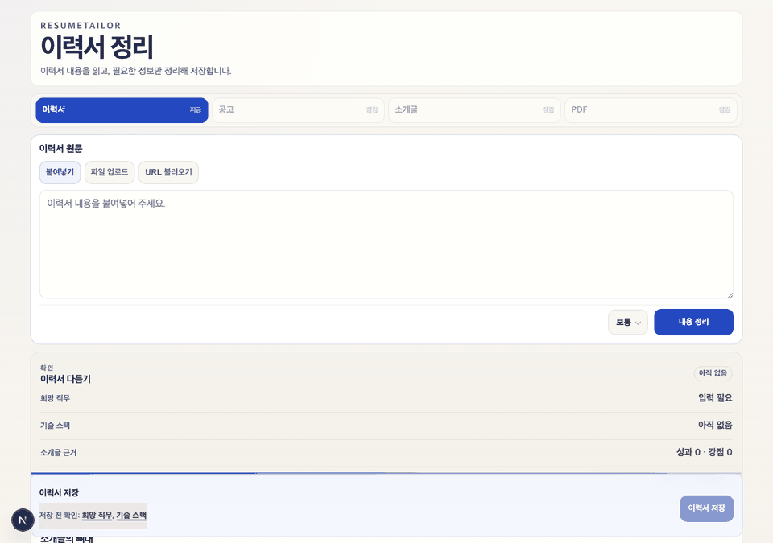
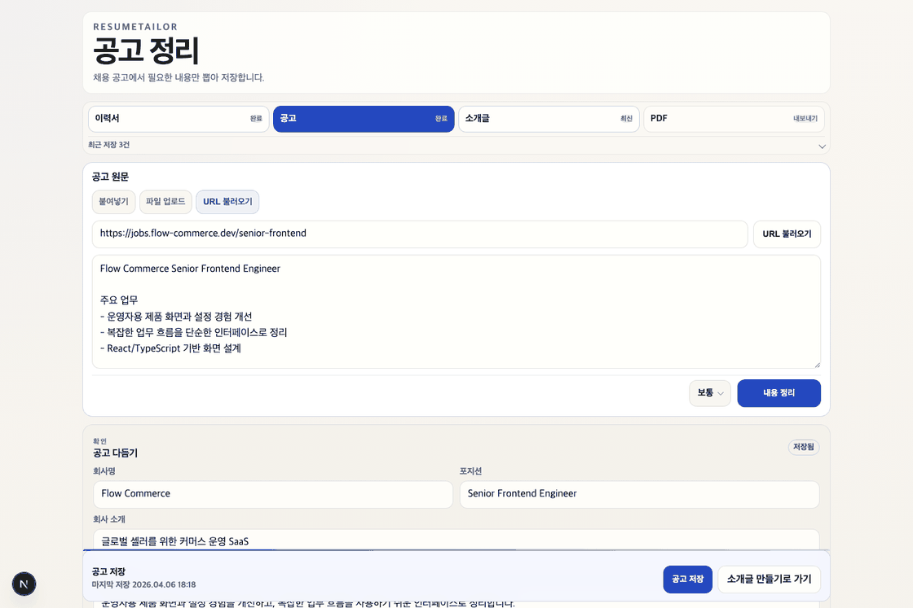
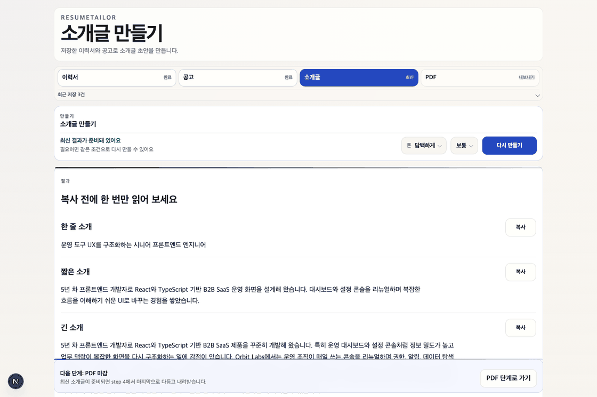
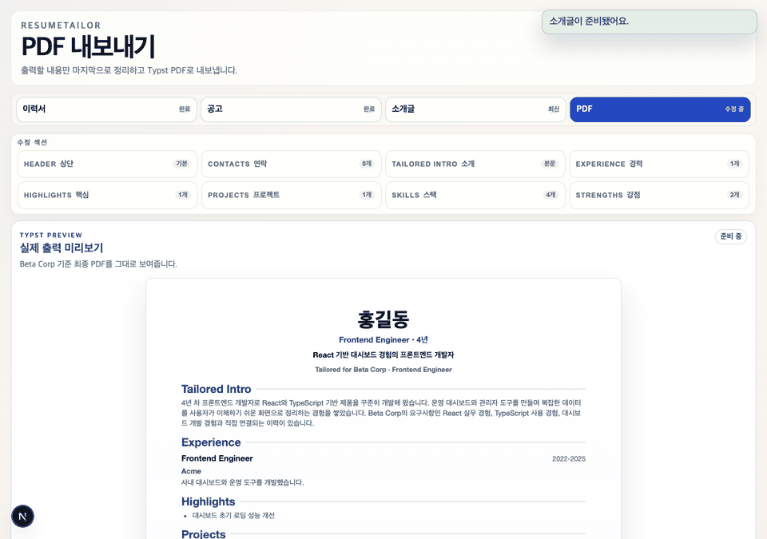

# ResumeTailor (Local MVP)

로컬에서 이력서와 채용공고 텍스트를 `@openai/codex-sdk`와 로컬 `SKILL.md` 파이프라인으로 구조화하고, 회사 맞춤 자기소개와 PDF까지 만드는 Next.js 앱입니다.

문의사항이나 오류 제보는 [qrqrq23r@gmail.com](mailto:qrqrq23r@gmail.com) 으로 보내 주세요.

## 화면 미리보기

전체 흐름과 각 단계의 실제 화면을 순서대로 볼 수 있습니다.


### Step 1. 이력서 정리

이력서 원문을 붙여넣거나 불러온 뒤 구조화하고 저장합니다.



### Step 2. 공고 정리

채용공고 본문을 구조화하고 요구사항과 기술 스택을 정리합니다.



### Step 3. 소개글 생성

확정된 이력서와 공고를 바탕으로 맞춤 소개글과 근거를 생성합니다.



### Step 4. PDF 내보내기

최종 내용을 다듬으면서 실제 미리보기를 확인하고 PDF를 내보냅니다.



## 1. 빠른 시작

이 프로젝트는 세 가지 방식으로 실행할 수 있습니다.

- Docker Hub 이미지로 실행
- 저장소를 clone해서 `docker compose`로 실행
- 로컬 개발 실행: 개발자가 Node.js와 Codex CLI를 직접 설치해서 실행

### 1.1 Docker Hub 이미지로 바로 실행

기본 이미지는 `qrqr/resume-tailor:latest`입니다.

필요:

- Docker Desktop 또는 Docker Engine
- Codex 로그인 가능한 계정
- ChatGPT 설정 `보안`에서 `Codex용 장치 코드 인증 활성화`

실행:

```bash
docker pull qrqr/resume-tailor:latest
docker volume create resume-tailor-codex

docker run --rm -it \
  -v resume-tailor-codex:/root/.codex \
  qrqr/resume-tailor:latest \
  codex login --device-auth

docker run -d \
  --name resume-tailor-app \
  -p 3000:3000 \
  -v resume-tailor-codex:/root/.codex \
  qrqr/resume-tailor:latest
```

- 접속 주소: [http://localhost:3000](http://localhost:3000)
- 로그인 정보는 `resume-tailor-codex` Docker volume에 저장됩니다.

중지, 재시작, 정리:

```bash
docker stop resume-tailor-app
docker start resume-tailor-app
docker rm -f resume-tailor-app
docker volume rm resume-tailor-codex
```

- `resume-tailor-codex` volume을 지우면 Codex 로그인 정보도 함께 삭제됩니다.

### 1.2 저장소를 clone해서 `docker compose`로 실행

반복 실행, 포트 관리, 커스텀 이미지 override가 필요하면 저장소를 clone한 뒤 `docker compose`로 실행합니다.

```bash
git clone https://github.com/aqwsde321/resume-tailor.git
cd resume-tailor
docker compose pull
docker compose run --rm app codex login --device-auth
docker compose up -d
```

- 접속 주소: [http://localhost:3000](http://localhost:3000)
- 일반 사용자는 `docker compose build`가 필요 없습니다.
- Compose 방식에서는 로그인 정보가 `codex-home` Docker volume에 저장됩니다.

중지와 정리:

```bash
docker compose stop
docker compose down
docker compose down -v
```

- `docker compose down -v`를 실행하면 `codex-home` volume도 삭제되어 다시 로그인해야 합니다.

### 1.3 로컬 개발 실행

Docker를 쓰지 않고 직접 실행하려면 아래가 필요합니다.

- Node.js 20 이상
- npm
- Codex 앱 또는 Codex CLI
- Codex 로그인 가능한 계정
- `typst` CLI: `/pdf`의 실제 Typst 미리보기와 PDF 내보내기를 로컬에서 쓰려면 PATH에 있어야 합니다.

Node.js는 LTS 설치를 권장합니다.

- 공식 다운로드: [https://nodejs.org/en/download](https://nodejs.org/en/download)
- Codex CLI 문서: [https://developers.openai.com/codex/cli](https://developers.openai.com/codex/cli)

기본 실행 순서:

```bash
npm i -g @openai/codex
codex login
npm install
npm run dev
```

브라우저에서 [http://localhost:3000](http://localhost:3000)으로 접속하면 루트 경로가 `/resume`으로 이동합니다.

<details>
<summary>macOS에서 Codex 앱 번들을 직접 쓰는 경우</summary>

macOS에서 Codex 앱 번들을 직접 쓸 때는 같은 터미널 세션에서 아래처럼 지정할 수 있습니다.

```bash
export CODEX_CLI_PATH=/Applications/Codex.app/Contents/Resources/codex
$CODEX_CLI_PATH login
npm run dev
```

</details>

## 2. 첫 사용 흐름

1. `/resume`에서 이력서 텍스트를 붙여넣거나 `txt`, URL로 불러온 뒤 분석하고, 폼을 수정해 확정합니다.
2. `/company`에서 채용공고 텍스트를 붙여넣거나 `txt`, URL로 불러온 뒤 분석하고, 폼을 수정해 확정합니다.
3. `/result`에서 자기소개를 생성하거나 다시 생성합니다.
4. 최신 소개글이 준비되면 `/pdf`로 이동해 마지막으로 PDF 전용 필드를 조정하고 PDF를 내려받습니다.

- 기능 범위와 상태 규칙: [서비스 기획서](./docs/SERVICE_PLAN.md)
- URL 불러오기와 OCR 제약: [채용공고 불러오기 가이드](./docs/COMPANY_FETCH_GUIDE.md)
- 소개글 품질 기준: [자기소개 품질 가이드](./docs/INTRO_QUALITY_GUIDE.md)

## 3. 환경 변수

필수는 아니지만, 아래 변수를 사용하면 실행 환경을 조정할 수 있습니다.

- `CODEX_CLI_PATH`: `codex` 바이너리가 PATH에 없을 때 직접 경로 지정
- `CODEX_SKILLS_DIR`: 외부 스킬 디렉터리를 우선 탐색하고 싶을 때 지정
- `RESUME_TAILOR_IMAGE`: `docker compose` 실행 시 사용할 이미지 경로를 바꾸고 싶을 때 지정
- `APP_PORT`: `docker compose` 실행 시 앱 포트를 바꾸고 싶을 때 지정

기본 스킬 탐색 순서:

1. `$CODEX_SKILLS_DIR/<skill>/SKILL.md`
2. `./skills/<skill>/SKILL.md`

예시:

```bash
export CODEX_CLI_PATH=/Applications/Codex.app/Contents/Resources/codex
export CODEX_SKILLS_DIR="$HOME/.codex/skills"
```

Docker 실행에서는 `CODEX_CLI_PATH`가 필요하지 않습니다. Codex CLI는 컨테이너 안에 포함됩니다.

기존 `RESUME_MAKE_IMAGE`도 Docker Compose fallback으로 잠시 지원하지만, 새 설정은 `RESUME_TAILOR_IMAGE`를 기준으로 사용합니다.

## 4. 주의사항

- 로컬 단일 사용자 시나리오를 기준으로 설계되어 있습니다.
- 로컬 실행에서 `/pdf`의 실제 Typst 미리보기와 PDF 내보내기를 쓰려면 `typst` CLI가 필요합니다.
- 공고 URL 불러오기는 사이트 구조에 따라 정확도가 달라질 수 있습니다. 처리 방식은 [채용공고 불러오기 가이드](./docs/COMPANY_FETCH_GUIDE.md)를 참고하세요.
- 서버리스나 원격 배포용 문서는 아직 포함하지 않습니다.
- Docker 실행도 최초 1회 Codex 인증은 필요합니다.

## 5. 검증 명령

```bash
npm run lint
npm run typecheck
npm run test
npm run test:pdf-visual
npm run test:e2e
npm run build
```

- 실제 Typst SVG/PDF smoke test는 `tests/lib/pdf-build.test.ts`에 포함되어 있습니다.
- PDF 시각 회귀 baseline 검증은 `tests/lib/pdf-visual.test.ts`와 `npm run test:pdf-visual`로 실행할 수 있습니다.

## 6. 배포

`main` 브랜치에 push되면 GitHub Actions가 Docker Hub `qrqr/resume-tailor` 이미지를 자동으로 갱신합니다.

- 운영 점검과 장애 대응은 [운영 런북](./docs/OPS_RUNBOOK.md)을 참고하세요.

## 7. 문서

세부 문서와 역할 분리는 [문서 인덱스](./docs/README.md)를 참고하세요.
